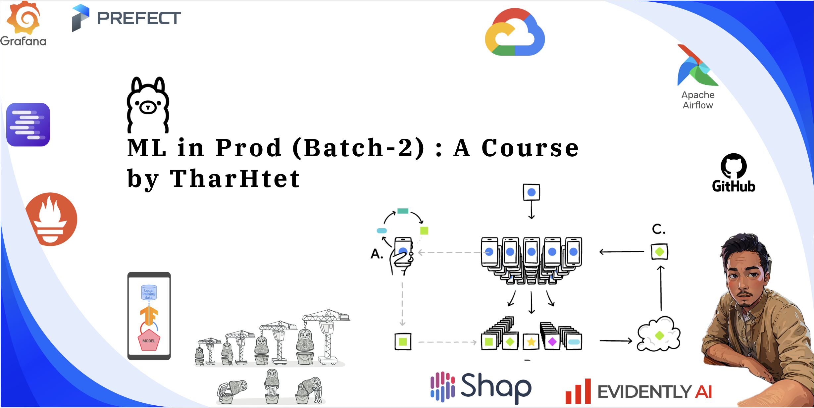

# Machine Learning Systems for Production (Batch-2)

This repository contains materials for the "Machine Learning Systems for Production" course by [Thar Htet San](https://github.com/tharhtetsan). The lecture videos are available on the [Deepfaro YouTube channel](https://www.youtube.com/@deepfaro). This course focuses on MLOps, covering the following key topics:

- Addressing technical debts in MLOps.
- Framing problems as ML solutions.
- Approaching ML systems using current project management techniques.
- Setting up a development environment for ML projects.
- Creating an ML lifecycle management system.
- Handling data drift, model drift, and monitoring in ML systems.
- Systematically managing the ongoing development of ML systems.

## Course Outlines

### Chapter 1: Basic Python Logic

| Day       | Topics Covered                                                                 | Source Code |
|-----------|----------------------------------------------------------------------------------|-------|
| [Day 1](https://youtu.be/TcLsSfVlrvw) | - Course Introduction    - Tools and Git Config   - Anaconda and Python Syntax | [1_Python_Basic_and_git](https://github.com/tharhtetsan/ML-in-Prod-batch-2/tree/main/1_Python_Basic_and_git) |
| [Day 2](https://youtu.be/43wYGtQgXKU) | - Python class and object   - Ollama Usage   - Pandas   - List   - Function Decorator   - Args vs kwargs | [1_Python_Basic_and_git](https://github.com/tharhtetsan/ML-in-Prod-batch-2/tree/main/1_Python_Basic_and_git) |

 
 

### Chapter-2 : Enviroment Setup
| Day       | Topics Covered                                                                 | Source Code |
|-----------|----------------------------------------------------------------------------------|-------|
| [Day 3](https://youtu.be/8-vuoEaJNXE) | - Anaconda Usage   - PipEnv setup   - Poetry for python Envs| [2_ProdAndDev_Env_Setup](https://github.com/tharhtetsan/ML-in-Prod-batch-2/tree/main/2_ProdAndDev_Env_Setup) |
-----------

 
 

### Chapter-3 : Image Processing
| Day       | Topics Covered                                                                 | Source Code |
|-----------|----------------------------------------------------------------------------------|-------|
| [Day 4](https://youtu.be/WqHgoYrLvW0) | - Basic Image Processing Techniques. - BGR and RGB. - Image lib : OpenCV and Pillow. - Line detection Sample Project | - [Basic Img Functions](https://github.com/tharhtetsan/ML-in-Prod-batch-2/blob/main/3_Image_Processing_Techniques/basic_img_funcs.ipynb)   - [Background/ Foreground extraction](https://github.com/tharhtetsan/ML-in-Prod-batch-2/blob/main/3_Image_Processing_Techniques/image_extraction.ipynb) |
-----------

 
 

### Chapter-4 : Machine Learning

| Day       | Topics Covered                                                                 | Source Code |
|-----------|----------------------------------------------------------------------------------|-------|
| [Day 5](https://youtu.be/_LMB6GCD7fI) | - OCR Project  - Decision Tree  - K-Means  - Navie Bayes | - [Img Processing for Invoic](https://github.com/tharhtetsan/ML-in-Prod-batch-2/blob/main/3_Image_Processing_Techniques/OCR_sample.ipynb)   - [OCR Project ](https://github.com/tharhtetsan/ML-in-Prod-batch-2/tree/main/3_Image_Processing_Techniques/OCR_proj)   |
| [Day 6](https://youtu.be/oGXVHlluo0U) | - Linear Regression coding   - Decission Tree, Navie Bayes, K-Means Coding   - Single perceptron (from scratch ) | - [Decision Tree and Navie Bayes : Framework](https://github.com/tharhtetsan/ML-in-Prod-batch-2/blob/main/4_MachineLearning/1.%20Decision%20Tree%20and%20Navie%20Bayes/Decision_tree_framework.ipynb)   - [Decision Tree : Native ](https://github.com/tharhtetsan/zero_2_hero_ml/blob/main/6_Machine_Learning/Decision%20Tree/1.%20Decision_treeDecision_native.ipynb)    - [K-Means Clustering : Framework](https://github.com/tharhtetsan/ML-in-Prod-batch-2/blob/main/4_MachineLearning/2.%20K_means_clustering/k_means_Image_Clustering.ipynb)  - [K-Means Clustering : Native](https://github.com/tharhtetsan/zero_2_hero_ml/blob/main/6_Machine_Learning/K-Mean%20Clustering/k_means_native/K-mean_Clustering_native.ipynb)    - [Navie Bayes : Framework ](https://github.com/tharhtetsan/ML-in-Prod-batch-2/blob/main/4_MachineLearning/3.%20Navie%20Bayes/Navie_Bayes_framework.ipynb)  - [Navie Bayes : Native ](https://github.com/tharhtetsan/zero_2_hero_ml/blob/main/6_Machine_Learning/Naive-Bayes-Classifier/Navie_Bayes_native_to_learn.ipynb)    - [Linear Regression](https://github.com/tharhtetsan/ML-in-Prod-batch-2/blob/main/4_MachineLearning/4.%20Linear%20and%20Logistic%20Regression/1.%20Linear%20Regression%20using%20Gradient%20Descent.ipynb)   - [Logistic Regression](https://github.com/tharhtetsan/ML-in-Prod-batch-2/blob/main/4_MachineLearning/4.%20Linear%20and%20Logistic%20Regression/3.%20Logistic%20Regression.ipynb)|
-----------

 
 

### Chapter-5 : Deep Learning
| Day       | Topics Covered                                                                 | Source Code |
|-----------|----------------------------------------------------------------------------------|-------|
| [Day 7](https://youtu.be/bc7Rap-8BfQ) | - Deep Learning  - Artificial Neural Network (ANN)   - Convolutional Neural Network (CNN)  - How calculate no of params for DL model - Tensorflow GPU install | - [ANN : Framework](https://github.com/tharhtetsan/ML-in-Prod-batch-2/blob/main/5_DeepLearning/ANN/tf_simple_NN.ipynb)   - [ANN : Native](https://github.com/tharhtetsan/ML-in-Prod-batch-2/blob/main/5_DeepLearning/ANN/Native%20Simple%20Logistic%20Regression.ipynb) |
| [Day 8](https://youtu.be/wGogjYowsdc) | - Env Setup for DL Proj   - TF Data Generators | - [TF generator : binary](https://github.com/tharhtetsan/ML-in-Prod-batch-2/blob/main/5_DeepLearning/tf_best_practices/tf_generator_binary.ipynb)   - [TF generator : categorical](https://github.com/tharhtetsan/ML-in-Prod-batch-2/blob/main/5_DeepLearning/tf_best_practices/tf_generator_category.ipynb) |
| [Day 10](https://youtu.be/DhWQs4OC5rI) | - Custom Data Generator   - Developing Custom TF model   - Custom Training  | - [TF Custom generator ](https://github.com/tharhtetsan/ML-in-Prod-batch-2/blob/main/5_DeepLearning/tf_best_practices/tf_custom_generator.ipynb)   - [TF Custom Model ](https://github.com/tharhtetsan/ML-in-Prod-batch-2/blob/main/5_DeepLearning/tf_best_practices/train_custom_generator.ipynb)   - [TF Custom Training ](https://github.com/tharhtetsan/ML-in-Prod-batch-2/blob/main/5_DeepLearning/tf_best_practices/tf_with_gradientTape.ipynb)|
| [Day 11](https://youtu.be/fRncoqi2Mug) | - Knowledge Distillation   - Teacher and Student Networks   - Tensorflow best practices |   - [Teacher and Student Networks ](https://github.com/tharhtetsan/ML-in-Prod-batch-2/blob/main/5_DeepLearning/tf_best_practices/knowledge_distillation.ipynb) |
-----------

 
 

### Chapter-6 : Containerization And Deployment
| Day       | Topics Covered                                                                 | Source Code |
|-----------|----------------------------------------------------------------------------------|-------|
| [Day 12](https://youtu.be/bJ9HUyVFM2c) | - Docker   - Flask   - FastAPI | - [Flask App](https://github.com/tharhtetsan/ML-in-Prod-batch-2/tree/main/6_Containerization_And_Deployment/sample_flask)   - [FastAPI App](https://github.com/tharhtetsan/ML-in-Prod-batch-2/tree/main/6_Containerization_And_Deployment/sample_fastapi) |
| [Day 13](https://youtu.be/Mm5JR2Y5gQo) | - Fastapi Schemas   - Async and Sync | - [Fastapi Schemas : Request/Response Model](https://github.com/tharhtetsan/ML-in-Prod-batch-2/blob/main/6_Containerization_And_Deployment/sample_fastapi/schemas.py)   - [Async and Sync](https://github.com/tharhtetsan/ML-in-Prod-batch-2/tree/main/6_Containerization_And_Deployment/async_and_sync) |
| [Day 14](https://youtu.be/Ea_ui7RTtxQ) | - Fastapi Schemas   - Async and Sync   - Text to Audio   - Text to Text | - [Text to Audio / Text to Text](https://github.com/tharhtetsan/ML-in-Prod-batch-2/blob/main/6_Containerization_And_Deployment/sample_fastapi/model_work.py) |
| [Day 15](https://youtu.be/0U97MYnwEvs) | - Design Pattern   - Structural vs Behavioral design patterns   - Structuring the project.   - Code formatter and clean code creation.   - Introduction to CloudRun | - [Design Pattern Examples ](https://github.com/tharhtetsan/ML-in-Prod-batch-2/tree/main/1_Python_Basic_and_git/design_pattern)   - [ML_in_Prod_batch_2_proj1](https://github.com/tharhtetsan/ML_in_Prod_batch_2_proj1) |
| [Day 16](https://youtu.be/4tiwUouEXrU) | - Set CI/CD in Project for CloudRun | - [Cloud Build ymal](https://github.com/tharhtetsan/ML_in_Prod_batch_2_proj1/blob/main/cloudbuild.yaml) |
| [Day 17](https://youtu.be/E7dlQXeBxdQ) | - Understanding artifact registry   - CloudRun versioning   - Run-time Variable in CI/CD | - |
| [Day 18](https://youtu.be/fiZQqM-UlS8) | - Github Action   - Code Formatting   -  Code Quality Check  - Unit Testing  - Automation the Unit Tests | [ci_sample.yml](https://github.com/tharhtetsan/ML_in_Prod_batch_2_proj1/blob/stg/.github/workflows/ci_sample.yml)|
-----------

 
 

### Chapter-7 : Data Version Control in ML Projs
| Day       | Topics Covered                                                                 | Source Code |
|-----------|----------------------------------------------------------------------------------|-------|
| [Day 19](https://youtu.be/ctY52c4CxpA) | - Introduction  to Data Version Control (DVC)   - DVC setup for dev environment.   - Introduction to MLflow. | - [DVC Setup Configs](https://github.com/tharhtetsan/ML-in-Prod-batch-2/tree/main/7_Data_version_control)  - [DVC Repo](https://github.com/tharhtetsan/ths_dvc_testing)   - [Getting Start with MLflow](https://github.com/tharhtetsan/ML-in-Prod-batch-2/blob/main/8_Experiment_Tracking/v1_getting_start_mlflow.ipynb)|
-----------

 
 

### Chapter-8 : Experiments Tracking in ML
| Day       | Topics Covered                                                                 | Source Code |
|-----------|----------------------------------------------------------------------------------|-------|
| [Day 20](https://youtu.be/4P4DyBbC8rM) | - Getting start with MLflow   - Logging API in MLflow   - MLflow client  - Model management in MLflow | - [Logging API in MLflow](https://github.com/tharhtetsan/ML-in-Prod-batch-2/blob/main/8_Experiment_Tracking/v2_logging_api.ipynb)  - [MLflow client](https://github.com/tharhtetsan/ML-in-Prod-batch-2/blob/main/8_Experiment_Tracking/v3_mlflow_client.ipynb)   -[Model management in Mlflow](https://github.com/tharhtetsan/ML-in-Prod-batch-2/blob/main/8_Experiment_Tracking/v4_test.ipynb)|
| [Day 21](https://youtu.be/Ao7SLYF-1J4) | - Compute Resources  - Eng-to-End MLflow |  -[End-to-End Mlflow](https://github.com/tharhtetsan/ML-in-Prod-batch-2/blob/main/8_Experiment_Tracking/v5_end2end_tf.ipynb)|
| [Day 22](https://youtu.be/2nFpFSWifCU) | - MLflow  backend store setup   - CloudSQL setup for MLflow | -|
| [Day 23](https://youtu.be/Y0DYW2vIHCA) | - MLflow Prod Setup Explain | [Secure-MLflow-Server-for-production](https://github.com/tharhtetsan/Secure-MLflow-Server-for-production)|
-----------

 
 

### Chapter-9 : ML Systems Monitoring
| Day       | Topics Covered                                                                 | Source Code |
|-----------|----------------------------------------------------------------------------------|-------|
| [Day 24](https://youtu.be/YPW53QtMXeg) | - Concept Drift   - Data Drift   - Feature Drift   - Label Drift  - Sample drift detection logic   - Introduction to EvidentlyAI | - [Data Drift Sample](https://github.com/tharhtetsan/ML-in-Prod-batch-2/blob/main/9_ML_System_Monitoring/drift_sample.ipynb)   -[Monitoring with Evidentlyai](https://github.com/tharhtetsan/ML-in-Prod-batch-2/blob/main/9_ML_System_Monitoring/v1_monitoring_basic.ipynb)|
| [Day 25](https://youtu.be/dq6qzffT9iA) | - Introduction to Monitoring Project   - Project setup with Prometheus and Grafana | [Monitoring-with-Prometheus-and-Grafana](https://github.com/tharhtetsan/ML-in-Prod-batch-2/tree/main/9_ML_System_Monitoring/monitoring_proj_prometheus)|
| [Day 26](https://youtu.be/lHhJ2TeYono) | - Introduction to Evidently Project.   - Setting up Evidently with streamlit App and FastAPI | -[Evidently Project Sample](https://github.com/tharhtetsan/ML-in-Prod-batch-2/blob/main/9_ML_System_Monitoring/monitoring_proj_evidently/train_regression_model.ipynb)   -[Monitoring Proj with EvidentlyAI](https://github.com/tharhtetsan/ML-in-Prod-batch-2/tree/main/9_ML_System_Monitoring/monitoring_proj_evidently)|
| [Day 27](https://youtu.be/vK6JLIlBIiA) | - Explain detail about Evidently Project. | [Monitoring Proj with EvidentlyAI](https://github.com/tharhtetsan/ML-in-Prod-batch-2/tree/main/9_ML_System_Monitoring/monitoring_proj_evidently) |
-----------

 
 

### Chapter-10 : PipeLine Orchestration
| Day       | Topics Covered                                                                 | Source Code |
|-----------|----------------------------------------------------------------------------------|-------|
| [Day 28](https://youtu.be/6FC_849BIxg) | - Data Orchestration   - Mage Pipeline vs Airflow Pipeline   - Airflow System Explain   - Role and User management in Airflow   - Bitshift Operators | [Bitshift Operator](https://github.com/tharhtetsan/ML-in-Prod-batch-2/blob/main/10_Pipeline_Orchestration/1_airflow/airflow_fundamentals/dags/v5_bitshift_task_connection_2.py) |
| [Day 29](https://youtu.be/JU36XfgUZXE) | - Chain in DAGs    -Tasks flow   - Decorators in Airflow   - Ariflow Variable vs System Variable   - Xcom  - Connections   -File Sensor| - [Airflow Variable vs System Variable](https://github.com/tharhtetsan/ML-in-Prod-batch-2/blob/main/10_Pipeline_Orchestration/1_airflow/airflow_fundamentals/dags/v9_variable.py)   -[File Sensors](https://github.com/tharhtetsan/ML-in-Prod-batch-2/blob/main/10_Pipeline_Orchestration/1_airflow/airflow_fundamentals/dags/v10_sensor_local_file_exist.py)   -[Python Sensors](https://github.com/tharhtetsan/ML-in-Prod-batch-2/blob/main/10_Pipeline_Orchestration/1_airflow/airflow_fundamentals/dags/v10_sensor_PythonSensor.py)|
| [Day 30](https://youtu.be/mrc5qwwsogA) |  - Scheduler in Ariflow  - GCP Bucket Sensors  - Custom Airflow Server Setup| - [GCP Bucket Sensors](https://github.com/tharhtetsan/ML-in-Prod-batch-2/blob/main/10_Pipeline_Orchestration/1_airflow/airflow_essential/dags/v10_sensor_gcpSensor.py)   -[Custom Airflow Server Setup](https://github.com/tharhtetsan/ML-in-Prod-batch-2/blob/main/10_Pipeline_Orchestration/1_airflow/airflow_essential/docker-compose.yml)|
-----------

 
 

### Chapter-11 :  Measuring ML model's performance and Matrices
 - I will add this chapter in next batch  🤓

 
 

### Chapter-12 : Distributed Workload in ML
| Day       | Topics Covered                                                                 | Source Code |
|-----------|----------------------------------------------------------------------------------|-------|
| [Day 31](https://youtu.be/h9e6Sp3qUJk) | - Apache Spark   - Spark System Explain   - Spark Native vs PandasAPI on Spark   - Memory and lazy execution explain|  -[Apache Spark](https://github.com/tharhtetsan/ML-in-Prod-batch-2/tree/main/12_Concurrency_In_AI_workloads) |
| [Day 32](https://youtu.be/h9e6Sp3qUJk) | - MLflow on Spark Cluster   - MLflow Genric Flavor   - Distributed Training on Spark Cluster| - [Custom-Apache-Spark-Cluster-run-databricks-locally](https://github.com/tharhtetsan/Custom-Apache-Spark-Cluster-run-databricks-locally)|
| [Day 33](https://youtu.be/lV6yKay2PQ0) | - MLflow model Generic Flavor - 2  - Hyperparameter tuning with Hyperopt   - CPU vs GPU vs Distributed Training   - Distributed Training with MLflow Generic Flavor | - |
-----------

 
 

### Chapter-13 : Advanced ai techniques
| Day       | Topics Covered                                                                 | Source Code |
|-----------|----------------------------------------------------------------------------------|-------|
| [Day 34](https://youtu.be/eYStG_4e-IU) |- Retrieval-Augmented Generation (RAGs) Explain   - RAGs Application and Sample Codes   - RAGs vs AI Agent Systems |  -[RAG](https://github.com/tharhtetsan/ML-in-Prod-batch-2/blob/main/13_Adv_AI_methods/RAG/test_text_model_nb_1.ipynb)  -[Agentic RAG](https://github.com/tharhtetsan/ML-in-Prod-batch-2/tree/main/13_Adv_AI_methods/Agentic_RAG) |
| [Day 35](https://youtu.be/T_AIdbQl964) | -  Agentic RAGs with Ollama   - Introduction to model context protocol (MCP)   - Hello world in MCP|  -[Hello-world MCP ](https://github.com/tharhtetsan/ML-in-Prod-batch-2/tree/main/13_Adv_AI_methods/MCP/hello-mcp) |
| [Day 36](https://youtu.be/gqtRruB13_s) | - Tools calling in AI Agents   - fuzzy output handling in agents   - MCP with Claude |  -[Tools calling in AI Agents ](https://github.com/tharhtetsan/ML-in-Prod-batch-2/blob/main/13_Adv_AI_methods/Agentic_RAG/crewai_tools_multiple_agent.ipynb)   -[MCP samples ](https://github.com/tharhtetsan/ML-in-Prod-batch-2/tree/main/13_Adv_AI_methods/MCP)|
| [Day 37](https://youtu.be/LjyZuV0eqkA) | - Fuzzy Output Handling   -Handling input and out in AI Agents   - Multimodel in AI Agents   - Adv agents input handling | -[Fuzzy Output Handling](https://github.com/tharhtetsan/ML-in-Prod-batch-2/blob/main/13_Adv_AI_methods/Agentic_RAG_projs/agent_output_handling/fuzzyOutput_actualOutput.ipynb)   [pydantic in Agent](https://github.com/tharhtetsan/ML-in-Prod-batch-2/blob/main/13_Adv_AI_methods/Agentic_RAG_projs/agent_output_handling/pydantic_output_2.ipynb)   -[Multimodala in Agents](https://github.com/tharhtetsan/ML-in-Prod-batch-2/blob/main/13_Adv_AI_methods/Agentic_RAG_projs/multiagent_with_multimodla/multi_modla_test.ipynb)   -[Adv agents input handling](https://github.com/tharhtetsan/ML-in-Prod-batch-2/blob/main/13_Adv_AI_methods/Agentic_RAG_projs/projPlanning/proj_planning.ipynb) |
| [Day 38](https://youtu.be/9Cs_-ok22no) |- Federated Machine Learning   - Decentralized Data Explain   - Federated Learning Project |   -[Federated Learning Project](https://github.com/tharhtetsan/ML-in-Prod-batch-2/tree/main/13_Adv_AI_methods/fed_lr) |
-----------

 
 

### Course References
- [MIT introtodeeplearning](http://introtodeeplearning.com/)

#### Reference Books
|[Designing Machine Learning Systems](https://www.amazon.com/Designing-Machine-Learning-Systems-Production-Ready/dp/1098107969)|[Deciphering Data Architectures](https://www.amazon.com/Deciphering-Data-Architectures-Warehouse-Lakehouse/dp/1098150767)|[Building an Event-Driven Data Mesh](https://www.amazon.com/Building-Event-Driven-Data-Mesh-Architectures/dp/1098127609)|[Building Generative AI Services with FastAPI](https://learning.oreilly.com/library/view/building-generative-ai/9781098160296/)|
|-----|-----|-----|-----|
|||||

## Course Proejcts
### - [ML_in_Prod_batch_1_proj](https://github.com/tharhtetsan/ML_in_Prod_batch_1_proj)
### - [ML_in_Prod_batch_1_proj2](https://github.com/tharhtetsan/ML_in_Prod_batch_1_proj2)
### - [Secure MLflow server setup for production](https://github.com/tharhtetsan/Secure-MLflow-Server-for-production)
### - [Distributed training with Custom Spark Cluster](https://github.com/tharhtetsan/Custom-Apache-Spark-Cluster-run-databricks-locally)
### - [RAG-for-NPC-Game-Characters](https://github.com/tharhtetsan/RAG-for-NPC-Game-Characters/tree/main)
### - [Agentic RAG for Real world problem](https://github.com/tharhtetsan/Agentic_RAGs)
### - [Text and Audio Generation in Serverless ](https://github.com/tharhtetsan/ML_in_Prod_batch_2_proj1)

### Connect Me
If you're interested in my course, feel free to connect with me.
